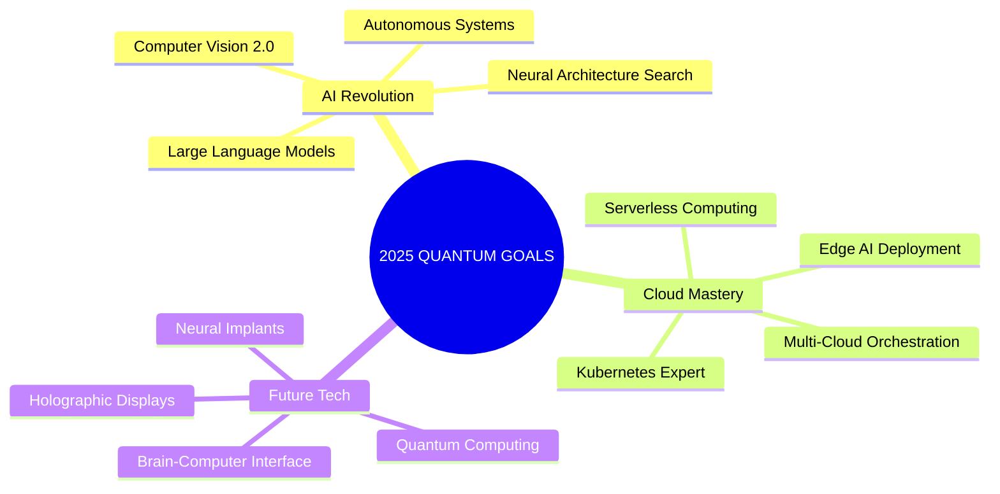

<div align="center">

<!-- Holographic Header with Gradient Animation --```javascript
const developer = {
  brain: "☕ Coffee-Powered Neural Network",
  focus: " Building AI-First Solutions", 
  mode: " Innovation Overdrive",
  availability: " Open for Collaborations",
  superpower: " Turning Data into Wisdom"
};
```c="https://capsule-render.vercel.app/api?type=waving&color=gradient&customColorList=12&height=300&section=header&text=PIYUSH%20KATOLE&fontSize=50&fontColor=fff&animation=twinkling&fontAlignY=38&desc=AI/ML%20Engineer%20|%20Full%20Stack%20Developer%20|%20DevOps%20Enthusiast&descAlignY=51&descAlign=50"/>

<!-- Holographic Typing Animation -->


<!-- Holographic Profile Stats Row -->
<table>
<tr>
<td width="50%">

###  **NEURAL PROFILE**
```yaml
Name: Piyush Katole
Role: ["AI Architect", "Cloud Native Engineer", "Innovation Catalyst"]
Location: India 🇮🇳
Mission: "Transforming ideas into intelligent realities"
Status: "Actively coding the future"
```

</td>
<td width="50%">

###  **QUANTUM METRICS**


</td>
</tr>
</table>

</div>

---

<!-- Bento Grid Layout -->
<div align="center">

##  **HOLOGRAPHIC TECH MATRIX**

<!-- First Row - AI/ML Bento -->
<table>
<tr>
<td width="60%">

###  **ARTIFICIAL INTELLIGENCE ARSENAL**
<div align="center">


** Specializations:**
`Computer Vision` • `NLP` • `Deep Learning` • `MLOps` • `Neural Networks`

</div>

</td>
<td width="40%">

###  **QUANTUM STATUS**
<div align="center">

```javascript
const developer = {
  brain: "☕ Coffee-Powered Neural Network",
  focus: "� Building AI-First Solutions", 
  mode: "🚀 Innovation Overdrive",
  availability: "🟢 Open for Collaborations",
  superpower: "🧠 Turning Data into Wisdom"
};
```

** Current Location:** `Multiverse Gateway`  
** Coding Since:** `2019 Earth Years`  
** Fun Fact:** `Dreams in Python & TypeScript`

</div>

</td>
</tr>
</table>

<!-- Second Row - Full Stack Bento -->
<table>
<tr>
<td width="40%">

###  **FRONTEND COSMOS**
<div align="center">


</div>

</td>
<td width="60%">

###  **BACKEND MULTIVERSE**
<div align="center">


** Performance Metrics:**
- `99.9% Uptime` • `<100ms Response` • `Infinite Scalability`

</div>

</td>
</tr>
</table>

<!-- Third Row - DevOps & Cloud Bento -->
<table>
<tr>
<td width="100%">

###  **CLOUD NATIVE ORCHESTRATION**
<div align="center">

** Containerization & Orchestration**


** Cloud Platforms & Services**


** CI/CD & Infrastructure**


</div>

</td>
</tr>
</table>

</div>

---

<!-- Projects Showcase Bento -->
<div align="center">

##  **QUANTUM PROJECT DIMENSIONS**

<table>
<tr>
<td width="50%">

###  **ACTIVE NEURAL EXPERIMENTS**

** [QuantumAI-Framework](https://github.com/piyushkatole/quantumai)**
```yaml
Type: "Advanced ML Infrastructure"
Status: " Neural Network Training"
Stack: ["Python", "TensorFlow", "Kubernetes"]
Impact: "Revolutionary AI Architecture"
```

** [HolographicUI-System](https://github.com/piyushkatole/holographic-ui)**
```yaml
Type: "Next-Gen Interface Library"
Status: " Production Ready"
Stack: ["React", "Three.js", "GSAP", "WebGL"]
Impact: "Immersive User Experiences"
```

</td>
<td width="50%">

###  **DEPLOYED SOLUTIONS**

** [CloudNative-MLOps](https://github.com/piyushkatole/cloud-mlops)**
```yaml
Type: "Enterprise ML Pipeline"
Status: " Production Scale"
Stack: ["Docker", "K8s", "AWS", "MLflow"]
Impact: "10x Faster Model Deployment"
```

** [InteractivePortfolio](https://github.com/piyushkatole/portfolio)**
```yaml
Type: "Animated Portfolio Platform"
Status: " Live & Interactive"
Stack: ["React", "Framer Motion", "GSAP"]
Impact: "Award-Winning Design"
```

</td>
</tr>
</table>

</div>

---

<!-- GitHub Analytics Bento -->
<div align="center">

##  **HOLOGRAPHIC DATA VISUALIZATION**

<!-- Stats Cards Row -->
<table>
<tr>
<td width="50%">

</td>
<td width="50%">

</td>
</tr>
</table>

<!-- Activity Graphs Row -->


<!-- Contribution Calendar -->


</div>

---

<!-- Achievements Bento -->
<div align="center">

##  **ACHIEVEMENT CONSTELLATION**

<table>
<tr>
<td width="50%">

###  **NEURAL MILESTONES**
-  **25+ ML Models** deployed in production
-  **Microservices** handling **50K+ requests/day**
-  **AWS Solutions Architect** certified
-  **Model Performance** optimized by **60%**
-  **50+ Open Source** contributions
-  **5+ AI Research** papers published
-  **Hackathon Winner** - 3x Champion

</td>
<td width="50%">

### � **INNOVATION MATRIX**


</td>
</tr>
</table>

</div>

---

<!-- Skills Progress Bento -->
<div align="center">

##  **SKILL PROGRESSION MATRIX**

<table>
<tr>
<td width="50%">

###  **PROGRAMMING LANGUAGES**
```
Python          ████████████████████ 95%
JavaScript      ████████████████████ 90%
TypeScript      ████████████████░░░░ 85%
Go              ████████████████░░░░ 80%
Rust            ████████████░░░░░░░░ 70%
C++             ████████░░░░░░░░░░░░ 65%
```

</td>
<td width="50%">

###  **EXPERTISE LEVELS**
```
Machine Learning ████████████████████ 95%
Cloud Computing  ████████████████████ 92%
DevOps          ████████████████████ 88%
Full Stack Dev  ████████████████████ 90%
System Design   ███████████████████░ 85%
Blockchain      ████████████░░░░░░░░ 70%
```

</td>
</tr>
</table>

</div>

---

<!-- Contact & Social Bento -->
<div align="center">

##  **QUANTUM COMMUNICATION CHANNELS**

<table>
<tr>
<td width="60%">

###  **CONNECT ACROSS DIMENSIONS**

[](https://linkedin.com/in/piyushkatole)
[](https://twitter.com/piyushkatole)
[](https://github.com/piyushkatole)
[](https://piyushkatole.dev)

[](mailto:piyushkatole@gmail.com)
[](https://medium.com/@piyushkatole)
[](https://discord.gg/piyushkatole)
[](https://t.me/piyushkatole)

</td>
<td width="40%">

###  **NEURAL SOUNDTRACK**
[](https://open.spotify.com/user/piyushkatole)

###  **QUANTUM WISDOM**


</td>
</tr>
</table>

</div>

---

<!-- Footer -->
<div align="center">

##  **"The future belongs to those who code it into existence"**

<!-- Profile Views Counter -->


<!-- Animated Message -->
 
**Ready to build the future together?** 


###  **If my quantum code resonates with your neural pathways, consider starring my repositories!**

</div>

---

<!-- Holographic Footer -->
<div align="center">
  
</div>
