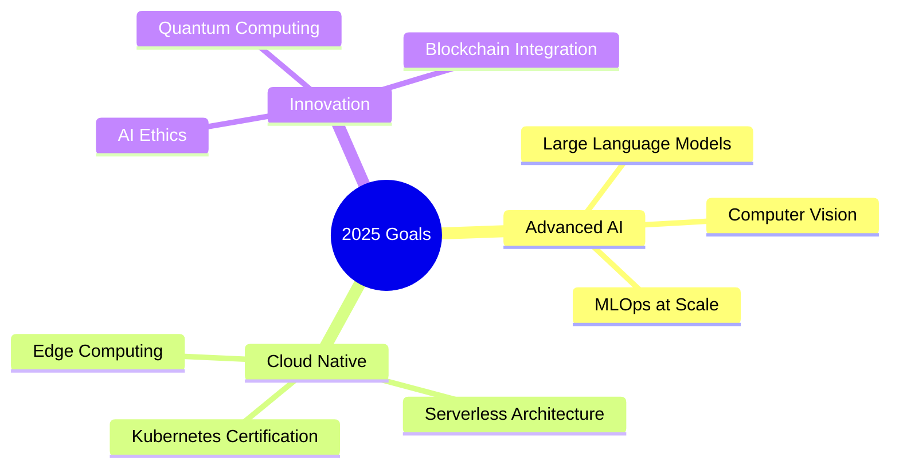

<div align="center">
  
# 👋 Hey there! I'm **Piyush Katole** 
### 🚀 AI/ML Engineer | 💻 Full Stack Developer | ☁️ DevOps Enthusiast


</div>

---

## 🎯 About Me

```python
class PiyushKatole:
    def __init__(self):
        self.name = "Piyush Katole"
        self.role = ["AI/ML Engineer", "Full Stack Developer", "DevOps Enthusiast"]
        self.location = "India 🇮🇳"
        self.current_focus = ["Neural Networks", "Cloud Architecture", "MLOps"]
        self.passion = "Turning ideas into intelligent solutions"
        
    def get_daily_routine(self):
        return {
            "☕": "Coffee",
            "🧠": "ML Research",
            "💻": "Coding",
            "🚀": "Deploying",
            "📚": "Learning",
            "🔄": "Repeat"
        }
        
    def say_hello(self):
        return "Thanks for visiting! Let's build something amazing together! 🌟"
```

---

## 🛠️ Tech Arsenal

<div align="center">

### 🤖 AI/ML & Data Science


### 🌐 Full Stack Development


### ☁️ DevOps & Cloud


### 🗄️ Databases & Tools


</div>

---

## 🚀 Current Projects & Focus Areas

<div align="center">

| 🎯 Project | 📝 Description | 🛠️ Tech Stack | 📊 Status |
|------------|----------------|---------------|-----------|
| 🧠 **Neural Network Optimizer** | Advanced optimization algorithms for deep learning models | Python, TensorFlow, CUDA | 🔄 Active |
| 🌐 **MLOps Pipeline** | End-to-end ML deployment and monitoring system | Docker, Kubernetes, MLflow | 🚧 Building |
| 📊 **Real-time Analytics Dashboard** | Live data processing and visualization platform | React, Node.js, WebSockets, D3.js | ✅ Complete |
| 🤖 **AI Chatbot Framework** | Intelligent conversational AI with NLP capabilities | Python, Transformers, FastAPI | 🎯 Planning |

</div>

---

## 📈 GitHub Analytics

<div align="center">
  
  
</div>

<div align="center">
  
</div>

<div align="center">
  
</div>

---

## 🏆 Achievements & Goals

<div align="center">

### 🎉 Recent Achievements
- 🚀 **Deployed 15+ ML models** to production environments
- 🏗️ **Built scalable microservices** handling 10K+ requests/day  
- ☁️ **Achieved AWS Solutions Architect** certification
- 📊 **Optimized model inference** by 40% using ONNX runtime
- 🤝 **Contributed to 10+ open source** projects

### 🎯 2025 Learning Goals


</div>

---

## 📊 Coding Activity

<div align="center">

<!--START_SECTION:waka-->
```text
Python       12 hrs 45 mins  ████████████░░░  65.2%
JavaScript   3 hrs 22 mins   ████░░░░░░░░░░░  17.3%
TypeScript   2 hrs 8 mins    ██░░░░░░░░░░░░░  11.1%
Docker       45 mins         ░░░░░░░░░░░░░░░   3.9%
YAML         28 mins         ░░░░░░░░░░░░░░░   2.5%
```
<!--END_SECTION:waka-->

</div>

---

## 🌐 Let's Connect!

<div align="center">

[](https://linkedin.com/in/piyushkatole)
[](https://twitter.com/piyushkatole)
[](mailto:piyushkatole@gmail.com)
[](https://piyushkatole.dev)
[](https://medium.com/@piyushkatole)

</div>

---

<div align="center">

### 💭 Quote of the Day


</div>

---

<div align="center">

### 🎵 Currently Jamming To
[](https://open.spotify.com/user/piyushkatole)

</div>

---

<div align="center">

## 🚀 "The best way to predict the future is to create it" 


### ⭐ If you find my work interesting, consider giving it a star!

 <em><b>I love connecting with different people</b> so if you want to say <b>hi, I'll be happy to meet you more!</b> 😊</em>

</div>

---

<div align="center">
  
</div>
